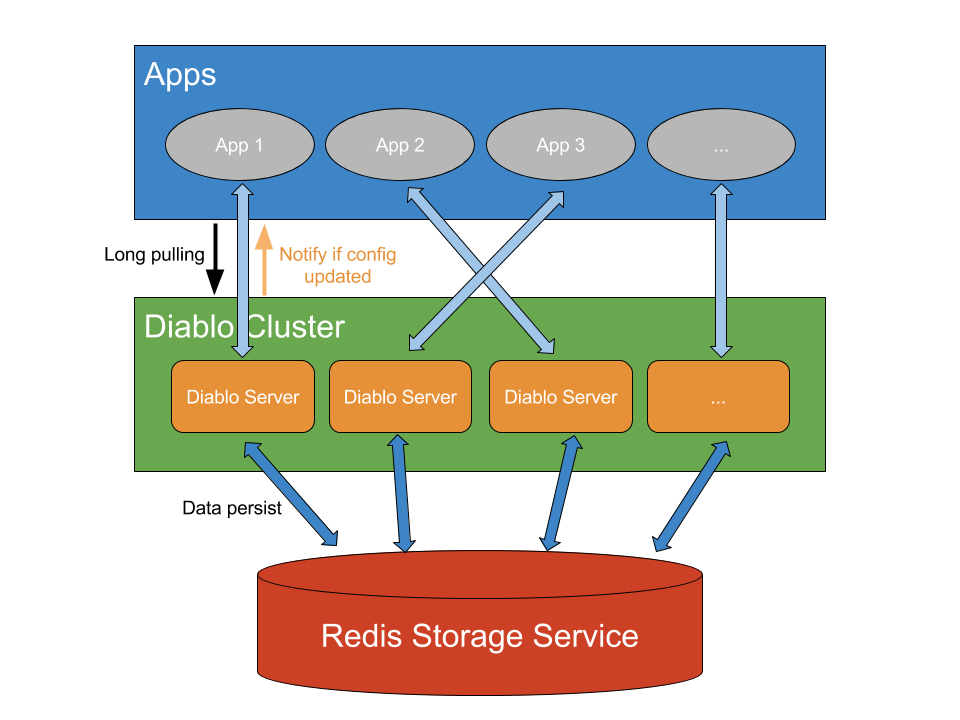
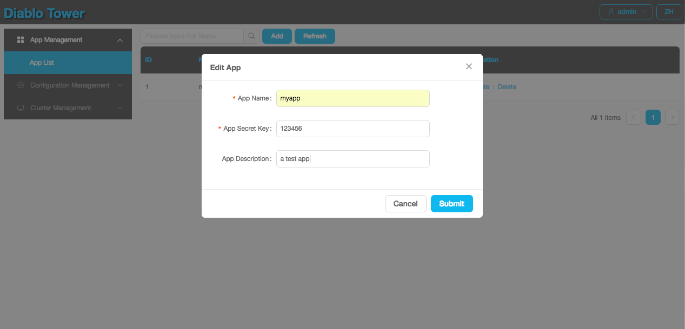

<p align="center">
  
</p>

A Lightweight Distributed Configuration Management Platform
---

[中文wiki](README.md).

<a href="http://diablo.hao0.me" target="_blank">Online Demo</a>: User/Password(admin/admin123).

## Features

+ **Lightweight**: these aren't complex techs and third dependencies;

+ **Storage**: Use **Redis** as data storage，you can use **Redis Cluster**，**Redis Master-Slave** or **Redis Proxy Middleware** etc. to guarantee data is high avaliable;

+ **Equivalent Server Nodes**: Multiple server nodes guarantee that Configuration Service is high avaliable, even though some server nodes are unavaliable;

+ **Near Realtime Updating**: diablo use **Http Long Pulling** to guarantee that **config modification** notify the clients at the near realtime;

+ **Elegant UI**: diablo embedded a simple and elegant web UI，I called it 
**Diablo Tower**;

+ ...

## Diablo Architecture



## Quick start

### Install

+ [Download](https://github.com/ihaolin/diablo/releases) the lastest package；
+ or build with source code:

	```bash
	mvn clean package -DskipTests
	# package located diablo-server/target/diablo-server.tar.gz
	```

+ Unpack the package：

	```bash
	tar zxf diablo-server.tar.gz
	ll diablo
	bin		# the execute scripts
	conf	# conf dir
	lib		# dependency libs
	```	

+ Edit the **diablo.conf** file：

	```bash
	# vim ${DIABLO_HOME}/conf/diablo.conf
	# The server bind address
	BIND_ADDR=127.0.0.1
	
	# The server listening port
	LISTEN_PORT=2143
	
	# The redis host
	REDIS_HOST=127.0.0.1
	
	# The redis port
	REDIS_PORT=6379
	
	# The log path
	LOG_PATH=~/logs/diablo
	
	# The password for Diablo Tower admin
	TOWER_PASS=admin
	
	# The inverval(seconds) for checking server's status
	CHECK_SERVER_INTERVAL=5
	
	# Enable or disable client api auth
	# client must config the appKey, if CLIENT_AUTH=true
	CLIENT_AUTH=true
	
	# Java Heap options
	JAVA_HEAP_OPTS="-Xms512m -Xmx512m"
	```

+ Start or stop the diablo server:

	```bash
	${DIABLO_HOME}/bin/diablo.sh start
	${DIABLO_HOME}/bin/diablo.sh stop
	${DIABLO_HOME}/bin/diablo.sh restart
	```

### Use the Diablo Tower

+ Access the **diablo tower** over http(e.g.[http://127.0.0.1:2143](http://127.0.0.1:2143)), once you started **diablo server**;

+ Prepare some **apps** and **configs**：
	
	+ edit app: 
		
		
	
	+ edit config:

		

### Integrate diablo client with applications

+ [SimpleDiabloClient](diablo-client/src/main/java/me/hao0/diablo/client/SimpleDiabloClient.java)(**Programming Mode**):
	
	+ add maven dependency:

		```xml
		<dependency>
            <groupId>me.hao0</groupId>
            <artifactId>diablo-client</artifactId>
            <version>${version}</version>
    	</dependency>
		```
	
	+ code snippet example:

		```java
		SimpleDiabloClient client = new SimpleDiabloClient();
       client.setAppName("myapp");
       client.setAppKey("123456");
       client.setServers("127.0.0.1:2143,127.0.0.1:2144");
       // You can add some config listener
       client.addListener(new ConfigListener<String>() {
            @Override
            public String name() {
                // config name
                return "test_config1";
            }

            @Override
            public void onUpdate(String newValue) {
                // trigger this method after the local config updated
                System.out.println("test_config1 has updated to " + newValue);
            }
        });
       client.start();
       
       // get the config's latest value
       String testConfig = client.get("test_config");
       
       // get the config's latest value as an json object
       MyClass myClass = client.get("test_json", MyClass.class);
       
       client.shutdown();
		```
	+ you also see these [test cases](diablo-client/src/test/java/me/hao0/diablo/client/SimpleDiabloClientTests.java).

+ [SpringDiabloClient](diablo-client-spring/src/main/java/me/hao0/diablo/client/SpringDiabloClient.java)(**Spring Inject Mode**):

	+ add maven dependency:

		```xml
		<dependency>
            <groupId>me.hao0</groupId>
            <artifactId>diablo-client-spring</artifactId>
            <version>${version}</version>
    	</dependency>
		```
	
	+ config the diablo client:

		```xml
		<bean class="me.hao0.diablo.client.SpringDiabloClient">
			<property name="appName" value="myapp" />
			<property name="appKey" value="123456" />
			<property name="servers" value="127.0.0.1:2143,127.0.0.1:2144" />
			<!-- optional configuration -->
			<property name="listeners">
				<list>
					<ref bean="activityNoListener" />
					<ref bean="timeInfoListener" />
					<ref bean="timeInfosListener" />
					<ref bean="timeInfoMapListener" />
				</list>
			</property>
			
			<!-- Some config listeners -->
			<bean id="activityNoListener" class="me.hao0.diablo.client.listener.ActivityNoListener" />
			<bean id="timeInfoListener" class="me.hao0.diablo.client.listener.TimeInfoListener" />
			<bean id="timeInfosListener" class="me.hao0.diablo.client.listener.TimeInfosListener" />
			<bean id="timeInfoMapListener" class="me.hao0.diablo.client.listener.TimeInfoMapListener" />
			
		</bean>
		```
	
	+ add your **diablo config bean** into **spring context**, such as:

		```java
		@Component
		public class MyAppConfig implements DiabloConfig {
		
			// basic types auto convert 
		    private String activityNo;
		    private Integer activityChannel;
		    private Boolean activityStart;
		    private Float activityRatio;
		    private Long activityCount;
		    private Double activityFee;
		 
		    // support common json object convert
		    private TimeInfo timeInfo;
		
		    // support one level List object convert
		    private List<TimeInfo> timeInfos;
		
		    // support one level Map object convert
		    private Map<String, TimeInfo> timeInfoMap;
			
			// getters and setters
		}
		```
		
	
	+ you also see these [test cases](diablo-client-spring/src/test/java/me/hao0/diablo/client/SpringDiabloClientTests.java).

+ So the client will receive config updated notifactions, once you updated the corresponding config items over the **Diablo Tower**.

## How to be a better man

+ If you feel not bad, it's time to buy me a cup of coffee

	+ Paypal:

		<a href="http://paypal.me/haolinh0" target="_blank">Buy me a cup of coffee</a>.
		
	+ Alipay:
		
		
	
	+ Wechat:
	   
	        